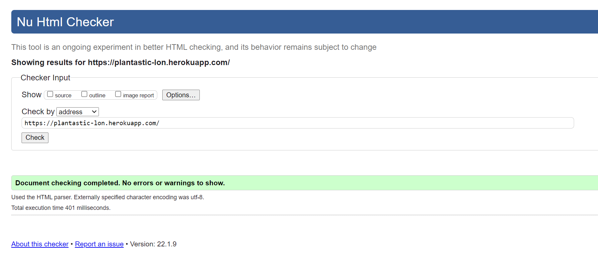
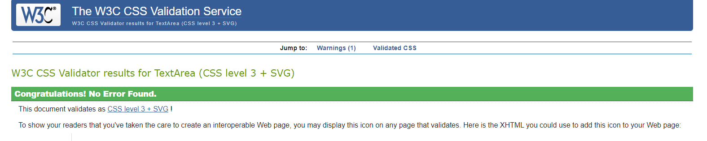

# Testing

[View live website here!](https://plantastic-lon.herokuapp.com/)

## Table of Contents

* [Testing User Stories from UX Section](#testing-user-stories-from-ux-section)

 

* [Testing](#testing)
    * [Automated Testing](#automated-testing)
        + [W3C Markup Validator](#w3c-markup-validator)
        + [W3C CSS Validation](#w3c-css-validation)
        + [JSHint](#jshint)
        + [PEP8 online check](#pep8-online-check)
    * [Manual Testing](#manual-testing)

  

* [Debugging](#debugging)
    * [Issues and Bugs](#issues-and-bugs)

 

# Testing User Stories from UX Section

## Shopper

* I want to be able to view a list of products.
    - On the products page there's a nice overview of all the products.
* I want to be able to view individual product details.
    - When the user click on a product it opens a product detail page with all necessary information.
* I want to be able to view the total of my purchases at any time.
    - In the upper right corner of the navbar the user is able to see the total of the product at any given moment.
* I want to be able to search for a product
    - With the search bar at in the navbar the user can easily search any product they like.
* I want to be able to easily see what I've searched for.
    - The search bar will stay filled with the search text as long as the user hasn't pressed enter.
* I want to be able to select qty of product when purchasing.
    - The user can select the amouont before putting it in the basket.
* I want to be able to view basket items.
    - By clicking on the basket the user can see the current state of their basket.
* I want to be able to adjust qty of items in my basket
    - The user can regulate the qty in the basket by clicking the minus and plus icons next to the product.
* I want to be able to easily enter payment info.
    - The user can go to the checkout and if logged in the delvery details will already be stated if that's not the case they can easily fill out the form.
* I want to be able toview an order confirmation after checkout.
    - The user gets an immediate order confirmation after checking out and they will also be able to see it if they have an account.
* I want to be able to Sign up for a newsletter.
    - The user can sign up for the newsletter through the link in the footer.

## Site User

* I want to be able to easily register for an account.
    - The user can sign up through the navbar.
* I want to be able to easily recover my password.
    - The user can choose for "forgot password" on the sign in page and recover their password.
* I want to be able to Receive email confirmation after registering.
    - When the user registers they get an email to confirm registering.
* I want to be able to have a personalised user profile.
    - When the user is logged in they can open their profile and see their delivery details and order history.

## Store owner

* I want to be able to add a product.
    - The store owner when logged in has the ability to add a product through the navbar.
* I want to be able to edit/update a product.
    - The store owner can edit or update a product by pressing edit on the product.
* I want to be able to delete a product.
    - The store owner can also press delete on any product.
* I want to be able to send a newsletter.
    - The store owner can navigate to newsletter in the navbar and make a message to send to subscribers.

## Automated Testing

### W3C Markup Validator

HTML code is validated through [W3C Validator](https://validator.w3.org/) - PASS

Rendered HTML from 'View page source' has been tested.

<b>RESULTS</b>

 

### W3C CSS Validation

CSS code is validated through [W3C Validator CSS](https://jigsaw.w3.org/css-validator/) - PASS

<b>RESULTS</b>

Static css:

Checkout css:

Profiles css:

### JSHint

JavaScript code is validated through [JSHint](https://jshint.com/) - PASS

Files being tested: base.js, countryfield.js and stripe_elements.js.

- Found no errors.
    - 1 undefined variable: $

### PEP8 online check

Python code is validated through [PEP8](https://www.python.org/dev/peps/pep-0008/) - PASS

- Only some lines were too long.

## Manual Testing

Plantastic app has been tested on Google Chrome, Internet Explorer, Microsoft Edge and Safari browsers (viewed at different desktop, laptop, tablet and mobile).

All links, required fields, buttons, sorting function, carousel, forms, blog posts, all drop-down menus, product display, product detail and search bar work as expected.

Code Institutes criteria checklist has been used to check requirements.

### Mail

I checked if a mail actually comes through when signing up and when the user subscribes to the newsletter. This functionality works and has no found issues.

### Stripe

I checked if Stripe works properly when purchasing and checking out and this works without problems aswell.

### Toasts 

Whenever an action requires confirmation a toast message shows up with the necassary details.

 

[Back to top](#testing)